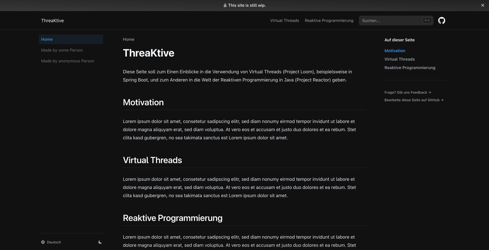

# ThreaKtive

This is a kind of documentation of the research and development project that was created as part of the Master's program in Business Informatics at the FH Münster University of Applied Sciences. Get started and gather a deeper insight into programming java with either virtual threads (Project Loom) or reactive programming (Project Reactor) with same minimalistic examples as well as real world applications.
For now, the only available language for this website is german.

[**Got to site →**](https://threaktive.vercel.app)

## Local Development

First, run `pnpm i` to install the dependencies.

Then, run `pnpm dev` to start the development server and visit localhost:3000.

If you have not yet used pnpm, you can install it e.g. via `npm install -g pnpm`.

## License

This project is licensed under the MIT License.
